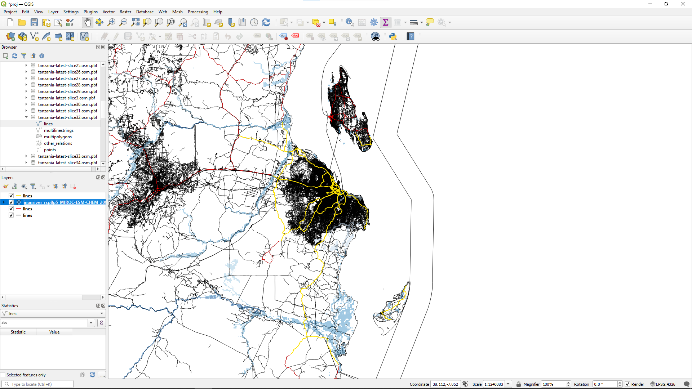

# 2. Filter each slice by infrastructure

The original data contains lots and lots of information about points of interest, waterways, etc.
We strip them down to versions that contain only information about highways (and only highways that
match one of the types we specified in `./config/filters.txt`, or whichever other file we declared
as the `osmium_tags_filters_file` variable in `./config/config.yaml`).

These files are in `./results/filtered/`, so let's open one up in QGIS.
Load `./results/filtered/tanzania-latest-slice32.highway-core.osm.pbf`, 
and notice that there are fewer roads than in the previous file.
We've coloured the roads in the new file in red.

If you zoom in a lot, you'll see there are many, many roads that are not included in this smaller file.
Here, we've zoomed in on the port area of the city.

