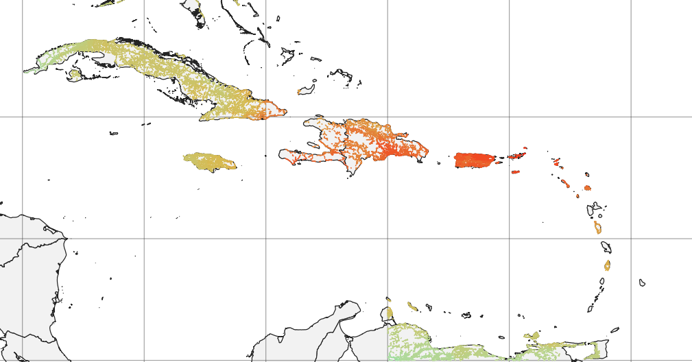

# Transmission line statistic aggregation

This file counts for each transmission line, the number of time that transmission line has been damaged over all 
processed storms. The first file `transmission_line_frequency_hit.gpkg` is a gpkg file in which the transmission line 
damage frequency is an attribute (`count_damage`) of the transmission line. This means that a visualisation in e.g. QGIS 
is simple to achieve with an example below.

 

 

However, this map is almost equivalent to simply the locations of most frequent storms and so we can further aggregate 
to the chosen level (config file: `aggregate_level` parameter). The reconstruction costs are used as the new metric as 
we are more interested in the aggregated direct damages to the power network. The config parameter ‘reconstruction_cost’ 
is used here. Note that this is a different example to the above figure.

The entire gathering and aggregation workflow can be called through the `analyse_transmission` rule.
