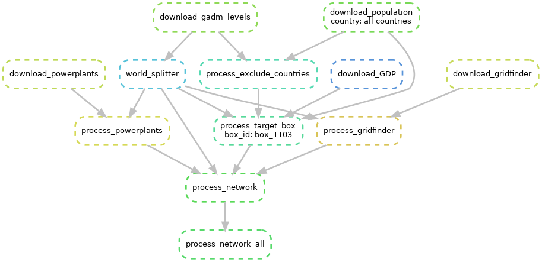

# Process network

Now that the [targets](power_process_targets.md), [powerplants](power_process_powerplants.md) and
[network components](power_process_gridfinder.md) have been processed, we can combine them into a network for each box.
This is achieved through the combination of the target, power plant and network node data into one node data frame where the
respective type is noted in the 'type' column. The snkit module (https://snkit.readthedocs.io/en/latest/index.html)
is then used to combine these nodes with the network component edges. The snkit module further tidies the spatial
network data.

### Workflow

The workflow is visualised as follows (including previous dependencies)

Again, only one box is selected for visual clarity, however, many boxes are typically processed in parallel for the
`process_target_box` rule.  Note that if there is no network in the box_id, then an empty .gpkg file is produced. This
is to allow for consistent snakemake workflows as it can not be known in advance.
 