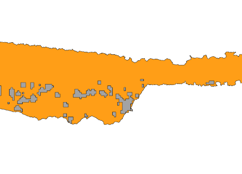
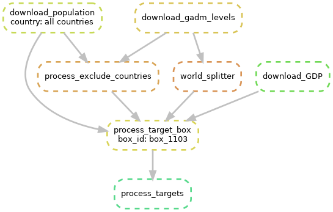
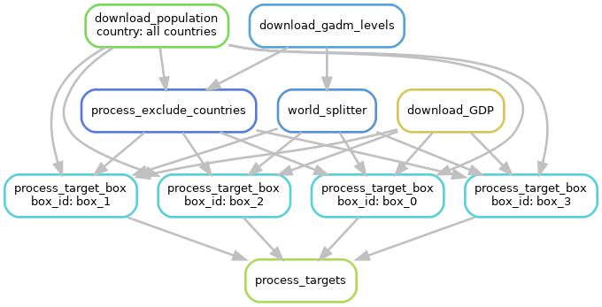

# Process targets

The idea behind this script is to take the [gridfinder input data](../download/power_download_gridfinder.md) and assign
populated locations a GDP value based on its location (country) and population. We refer to the populated locations
(e.g. villages, cities, etc) as targets. These will be the sinks of the power network. Below is an example figure in
which the grey regions represent the target locations.

### Workflow

The individual target processing workflow is visualised as follows.

However, as previously mentioned, there are likely to be many more boxes. To illustrate this, four boxes can be seen in the workflow below.

With a `box_width_height` value of 5 (deg), there would be 2592 boxes. Note that if no targets exist in the box_id, then an empty .gpkg file is
produced. This is to allow for consistent snakemake workflows as it can not be known in advance.

